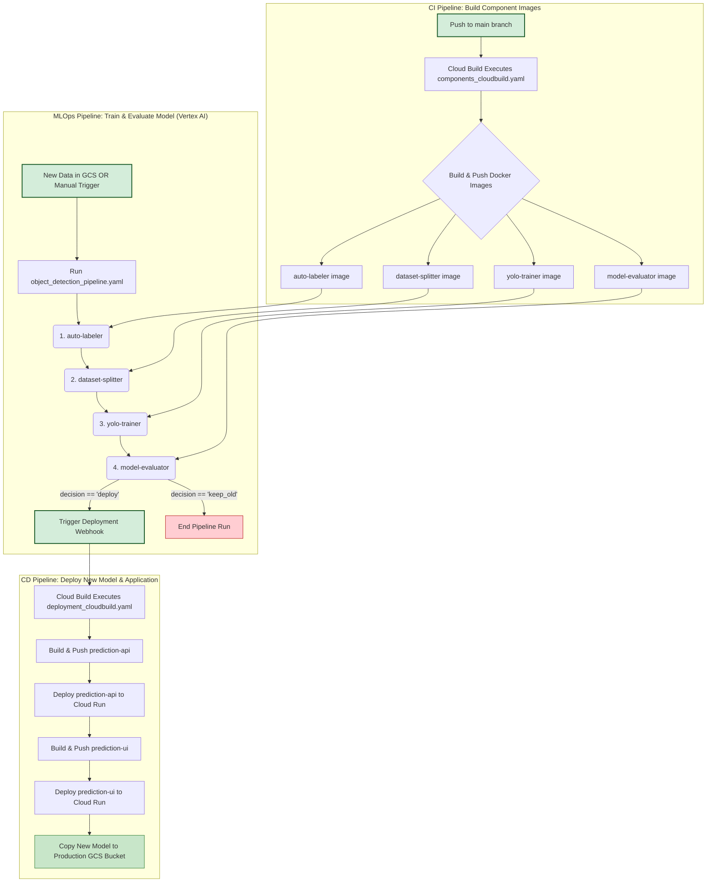

```mermaid
graph TD
    subgraph "CI Pipeline: Build Component Images"
        A[Push to main branch] --> B[Cloud Build Executes components_cloudbuild.yaml];
        B --> C{Build & Push Docker Images};
        C --> auto-labeler_img[auto-labeler image];
        C --> dataset-splitter_img[dataset-splitter image];
        C --> yolo-trainer_img[yolo-trainer image];
        C --> model-evaluator_img[model-evaluator image];
    end

    subgraph "MLOps Pipeline: Train & Evaluate Model (Vertex AI)"
        D[New Data in GCS OR Manual Trigger] --> E[Run object_detection_pipeline.yaml];
        E --> F(1. auto-labeler);
        F --> G(2. dataset-splitter);
        G --> H(3. yolo-trainer);
        H --> I(4. model-evaluator);
        I -- "decision == 'deploy'" --> J[Trigger Deployment Webhook];
        I -- "decision == 'keep_old'" --> K[End Pipeline Run];
    end

    subgraph "CD Pipeline: Deploy New Model & Application"
        J --> L[Cloud Build Executes deployment_cloudbuild.yaml];
        L --> M[Build & Push prediction-api];
        M --> N[Deploy prediction-api to Cloud Run];
        N --> O[Build & Push prediction-ui];
        O --> P[Deploy prediction-ui to Cloud Run];
        P --> Q[Copy New Model to Production GCS Bucket];
    end

    %% Define Dependencies directly to show the flow
    auto-labeler_img --> F;
    dataset-splitter_img --> G;
    yolo-trainer_img --> H;
    model-evaluator_img --> I;

    %% Styling
    style K fill:#ffcdd2,stroke:#b71c1c
    style Q fill:#c8e6c9,stroke:#2e7d32

    classDef trigger fill:#d4edda,stroke:#155724,stroke-width:2px;
    class A,D,J trigger;
```